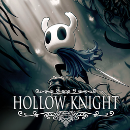



# Games

My top 5 games right now are:
1. Hollow Knight
2. ZZZ
3. Valorant
4. Overwatch
5. Brawl Stars

## Hollow Knight

Hollow knight is one of my favorite games of all time so far. It has some very good platforming and very good combat, with options for customization using "charms", which allow you to make yourself more powerful in certain aspects, such as the speed at which you can travel. Some of these charms even have unique interactions with each other. Personally, I think what makes the game so good is the world building. With it being a metroidvania, world building is an integral part of Hollow Knight. I think the way it is executed is the pinnacle of world building, with very few cutscenes and many small details hidden around the world that lets the player try to figure out what happened in the world of Hollow Knight for themselves. 